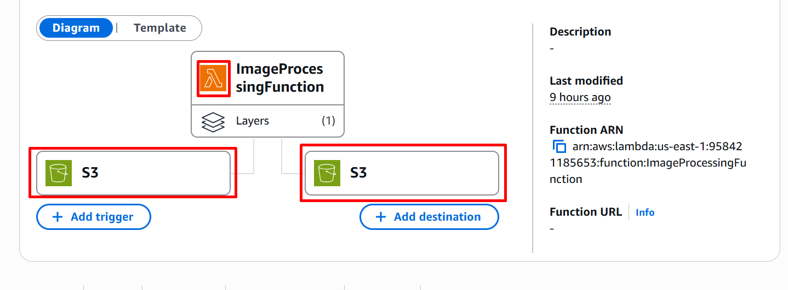
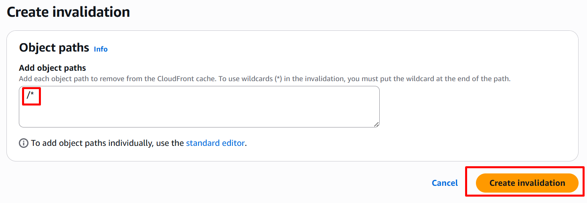

# Serverless Image Processing Pipeline with AWS 

This guide walks you through building a serverless image processing pipeline using AWS services: 

**S3, IAM ROLE, DynamoDB, Lambda and CloudFront.**

## Architecture Overview

1.	**Raw Images S3 Bucket** – Stores original uploaded images.
2.	**AWS Lambda** – Resizes and watermarks images.
3.    **IAM ROLE** -  Grants necessary permissions to access S3 and DynamoDB.
4.	**Processed Images S3 Bucket** – Stores processed images.
5.	**DynamoDB** – Stores metadata (filename, size, timestamp).
6.	**CloudFront** – Distributes processed images globally.

## Step-by-Step Setup

### Step 1. Create Source and Destination S3 Buckets:

1.	**Source bucket  -** Sample Name: ``image-source-bucket`` (**Private**)

<div align="center">
      
</div>

2. **Destination bucket  -**  

Sample Name: ``image-destination-bucket`` (**Private**)

3.	**Enable** Block all public access for both.

4.	Add appropriate **bucket policies in destination bucket** for **Lambda and CloudFront access**.
<div align="center">
      
</div>

**Both Bucket:**
<div align="center">
      
</div>

### Step 2. Create IAM Role for Lambda:

Go to AWS Console → Search IAM ROLE → Create Role.

<div align="center">
      
</div>

•	**Attach policies:**

```url
      AmazonS3FullAccess (read/write to both buckets)
      AmazonDynamoDBFullAccess (for metadata storage)
      CloudWatchLogsFullAccess` (for debugging)
```
<div align="center">
      
</div>
<div align="center">
      
</div>
<div align="center">
      
</div>
<div align="center">
      
</div>

• **Name it:** ``LambdaImageProcessingRole``
<div align="center">
      
</div>

##### Why needed: Without this role, Lambda will fail to access S3, DynamoDB or logs.

### Step 3. Create DynamoDB Table:
**AWS Console → DynamoDB →** **Create table**
**Table name:** ``ImageMetadata``
<div align="center">
      
</div>

**Partition key:** filename (String)

Leave other options `default` → **Create table**
<div align="center">
      
</div>

### Step 4. Create Lambda Function:

**Sample Name:** `ImageProcessingFunction`

**Runtime:** `Python 3.12`
<div align="center">
      
</div>

**Execution role:** `LambdaImageProcessingRole`

<div align="center">
      
</div>

**Attach Pillow Layer** (Example ARN for us-east-1) [Scroll down in Lambda Function]:

```url
   arn:aws:lambda:us-east-1:770693421928:layer:Klayers-p312-Pillow:6
```
<div align="center">
      
</div>

<div align="center">
      
</div>

**Configuration:**

<div align="center">
      
</div>

<div align="center">
      
</div>

<div align="center">
      
</div>

**Lambda Code:**

```url
import boto3

from PIL import Image, ImageDraw

import os

from datetime import datetime

s3 = boto3.client('s3')

dynamodb = boto3.resource('dynamodb')

table = dynamodb.Table('ImageMetadata')

def lambda_handler(event, context):``

    try:

        bucket = event['Records'][0]['s3']['bucket']['name']

        key = event['Records'][0]['s3']['object']['key']

        download_path = f"/tmp/{os.path.basename(key)}"
        processed_key = f"processed-{os.path.basename(key)}"
        upload_path = f"/tmp/{processed_key}"

        s3.download_file(bucket, key, download_path)

        img = Image.open(download_path)
        img = img.resize((800, 600))
        draw = ImageDraw.Draw(img)
        draw.text((10, 10), "Watermark", fill=(255, 255, 255))
        img.save(upload_path)

        s3.upload_file(upload_path, 'processed-image-bucket', processed_key)

        table.put_item(Item={
            'filename': processed_key,
            'size': os.path.getsize(upload_path),
            'timestamp': datetime.utcnow().isoformat()
        })

        return {'statusCode': 200, 'body': f'Successfully processed {key}'}
    except Exception as e:
        return {'statusCode': 500, 'body': str(e)}
```

#### Test Event Example:
```url
{
  "Records": [
    {
      "s3": {
        "bucket": {"name": "raw-image-bucket"},
        "object": {"key": "test-image.jpg"}
      }
    }
  ]
}
```
<div align="center">
      
</div>

<div align="center">
      
</div>

**Output:**
<div align="center">
      
</div>

### Step 5.  Set Environment Variables:

**SOURCE_BUCKET =** your source bucket name

**DEST_BUCKET =** your destination bucket name
<div align="center">
      
</div>
<div align="center">
      
</div>

**Final Output:**
<div align="center">
      
</div>

### Step 6. Configure CloudFront:

**AWS Console → CloudFront →** **Create Distribution**
**Set Distribution Name**
<div align="center">
      
</div>

**Select Origin of Destination Bucket:** ``processed-image-bucket.s3.amazonaws.com``

<div align="center">
      
</div>

**Set Redirect HTTP to HTTPS**

**Cache policy:** CachingOptimized
**Create Distribution**
**Go to S3 destination Bucket and Upload an ``index.html`` file in the destination bucket for testing:**
```url
<!DOCTYPE html>
<html>
<body>
<h1>Processed Image</h1>

</body>
</html>
```
<div align="center">
      
</div>

**Default Root Object:** ``index.html``

**Create Invitation**

<div align="center">
      
</div>

### Step 7. Test the Pipeline:
1.	Upload ``photo.jpg`` → **raw bucket**.

<div align="center">
      
</div>

2.	**Lambda processes it** → Upload ``processed-photo.jpg`` to processed bucket.
<div align="center">
      
</div>

3.	**DynamoDB** entry created with metadata.
<div align="center">
      
</div>

4.	View via **CloudFront URL**.
<div align="center">
      
</div>

### Notes:

•	Make sure both buckets are **private**.

•	**Lambda must have correct permissions** for both **buckets** and **DynamoDB**.

•	**CloudFront** should point to the **destination bucket**.

```url
✅You now have a fully functional serverless image processing pipeline with automatic resizing, watermarking, metadata storage and global distribution.
```
