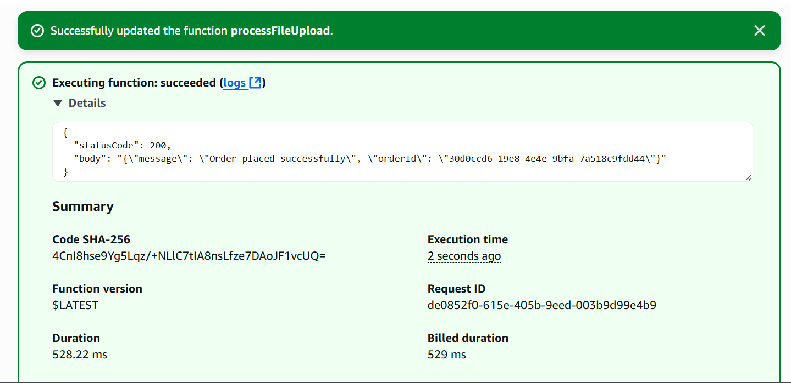

# 📢 Serverless Order Notification System

A simple **Serverless Project** built with **AWS API Gateway**, **Lambda**, **DynamoDB** and **SNS** to create an **order notification system** without managing any servers.


## 🚀 Project Flow

1. **Client (Frontend/App)**

   * A user places an order.
   * The client sends the order data (JSON format) via a **POST** request to the **API Gateway** endpoint.

2. **API Gateway**

   * Captures the **HTTP request**.
   * Passes the request data to the **Lambda function**.

3. **Lambda Function**

   * Validates and processes the data.
   * Stores the order in **DynamoDB**.
   * Publishes a notification to an **SNS Topic** (e.g., “New order received: XYZ”).

4. **SNS (Simple Notification Service)**

   * Sends the message to all **subscribers** (Email or SMS).


## 🛠 AWS Services Used

* **API Gateway** → Accepts incoming HTTP requests (from browser/app).
* **AWS Lambda** → Executes backend logic.
* **DynamoDB** → Stores order data.
* **SNS** → Sends notifications to subscribers.

## Architecture

<div align="center">
      
</div>

## 📋 Step-by-Step Setup

### **1️⃣ DynamoDB Setup**

1. Open **AWS Console** → Go to **DynamoDB** → **Create Table**.
2. **Table Name**: `FileMetaData`
3. **Primary Key**: `FileName` (String)
<div align="center">
      
</div>

4. Click **Create Table**.

### **2️⃣ SNS Topic and Subscription Setup**

**A. Create Topic**

1. AWS Console → **SNS** → **Topics** → **Create Topic**.
2. **Type**: Standard
3. **Name**: `file-upload-notification`
<div align="center">
      
</div>

4. Click **Create Topic**.

**B. Subscribe**

1. Open your SNS topic → Click **Create Subscription**.
2. **Protocol**: Email (or SMS)
3. **Endpoint**: Your email/phone.
<div align="center">
      
</div>

4. Confirm the subscription via the confirmation link.
<div align="center">
      
</div>
<div align="center">
      
</div>

### **3️⃣ Lambda Function Setup**

1. Go to **AWS Lambda** → **Create Function**.
2. **Name**: `processFileUpload`.
3. **Runtime**: Python 3.12.
<div align="center">
      
</div>

4. Click **Create Function**.

**Add IAM Permissions to Lambda Execution Role**:

* DynamoDB → `PutItem` on your table.
* SNS → `Publish` to your topic.
* CloudWatch Logs → Full access (for debugging).
<div align="center">
      
</div>

### **4️⃣ Lambda Function Code and Adding Layer**

**Replace the default code with:**

```python
import json
import boto3
import uuid
from datetime import datetime

dynamodb = boto3.resource('dynamodb')
sns = boto3.client('sns')

TABLE_NAME = "Your Table Name"
SNS_TOPIC_ARN = "Your SNS ARN"

def lambda_handler(event, context):
    try:
        body = event.get('body')
        if isinstance(body, str):
            body = json.loads(body)
        elif not isinstance(body, dict):
            body = {}

        customer_name = body.get('customerName')
        product_name = body.get('productName')

        if not customer_name or not product_name:
            return {
                'statusCode': 400,
                'body': json.dumps({'error': 'Missing customerName or productName'})
            }

        order_id = str(uuid.uuid4())
        order_time = datetime.utcnow().isoformat()

        table = dynamodb.Table(TABLE_NAME)
        table.put_item(
            Item={
                'Your Table's PK': order_id,
                'customerName': customer_name,
                'productName': product_name,
                'orderTime': order_time
            }
        )

        message = (
            f"📦 New Order Received!\n"
            f"Order ID: {order_id}\n"
            f"Customer: {customer_name}\n"
            f"Product: {product_name}"
        )

        sns.publish(
            TopicArn=SNS_TOPIC_ARN,
            Message=message,
            Subject="New Order Notification"
        )

        return {
            'statusCode': 200,
            'body': json.dumps({'message': 'Order placed successfully', 'orderId': order_id})
        }

    except Exception as e:
        return {
            'statusCode': 500,
            'body': json.dumps({'error': str(e)})
        }
```

#### Adding a Layer to AWS Lambda:

1. **Scroll down** in the Lambda function configuration page.
2. On the **right-hand side** locate the **Layers** section and click **Add a layer**.
<div align="center">
      
</div>

3. Choose **Specify an ARN**.
4. Enter the following example ARN for the `us-east-1` region:

   ```
   arn:aws:lambda:us-east-1:770693421928:layer:Klayers-p312-Pillow:6
   ```
5. Click **Add** to attach the layer to your Lambda function.

### **5️⃣ API Gateway Setup**

1. AWS Console → **API Gateway** → **Create API** (HTTP or REST).
<div align="center">
      
</div>

2. Create a **POST** route (e.g., `/create-order`).
<div align="center">
      
</div>

3. **Integration** → Select your Lambda function (`processOrder`).
<div align="center">
      
</div>

4. SCroll Down the Left Menu of this Function and Click Deploy and create Stage
<div align="center">
      
</div>

4. Enable **CORS** (for browser requests).
5. Deploy API → Copy the **Invoke URL**.

### **6️⃣ Add Lambda Trigger**

1. Go to your **Lambda function**.
2. **Add Trigger** → Select **API Gateway** → Choose your API.
<div align="center">
      
</div>

3. Leave **Destination** empty (default).


### **7️⃣ Testing**

**Test via Lambda Console**:

```json
{
  "body": "{\"customerName\": \"John Doe\", \"productName\": \"Wireless Mouse\"}"
}
```

<div align="center">
      
</div>

✅ **Check:**

* **DynamoDB** has the order record.
<div align="center">
      
</div>

* **SNS** sends the email/SMS notification.
<div align="center">
      
</div>

## 📌 Notes

* Make sure **SNS subscription** is **confirmed**, or you won’t receive messages.
* Always secure **API Gateway** with authentication in production.
* Use AWS Free Tier to avoid charges.

## 🎯 Outcome

By following these steps, you have:

* Built a **serverless order processing system**.
* Integrated **real-time notifications** via SNS.
* Stored orders in **DynamoDB** without provisioning any servers.