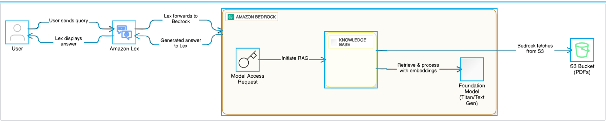
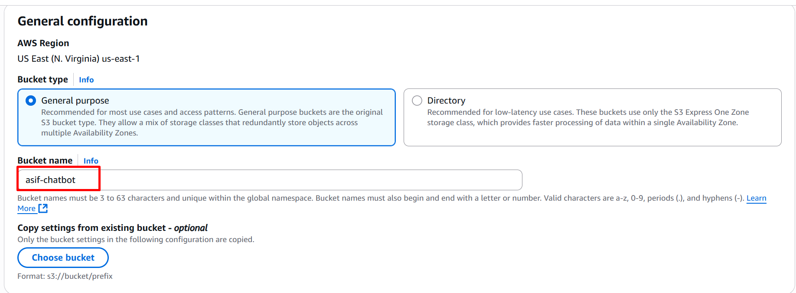
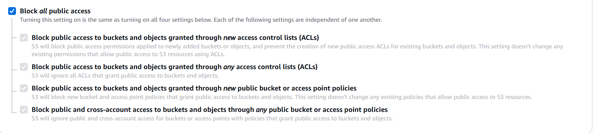
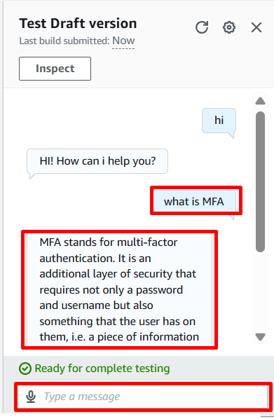
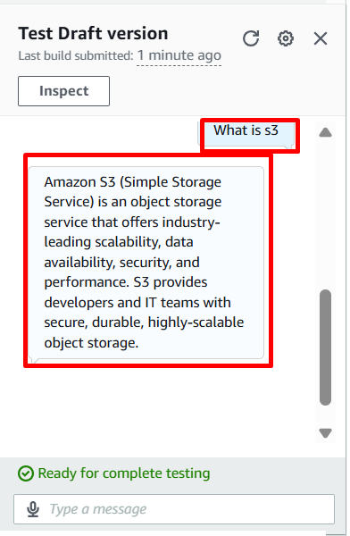
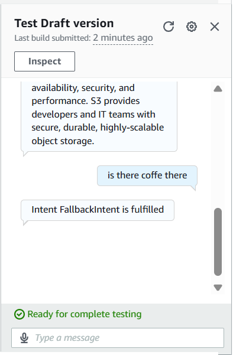

# Building an Intelligent AWS Chatbot with Amazon Bedrock & Amazon Lex 🤖

## 📄 Project Objective

The goal of this project is to build a robust, AI-driven chatbot that efficiently answers user questions by extracting relevant information from unstructured PDF documents stored in Amazon S3. By integrating Amazon Lex with an Amazon Bedrock knowledge base using Retrieval-Augmented Generation (RAG), the project delivers accurate and contextually relevant responses. This showcases proficiency in AWS technologies and advanced AI techniques designed for real-world applications.

## 🔧 Services Used

1. **Amazon Lex V2**: Provides the chatbot's conversational interface, handling user intents and utterances for seamless interaction.
2. **Amazon Bedrock**: Powers the knowledge base and generative AI models (e.g., Anthropic Claude V2) to support RAG-based query processing.
3. **Amazon S3**: Stores PDF documents that serve as the chatbot's knowledge base.
4. **Amazon OpenSearch Serverless**: Acts as the vector store for efficient semantic search within the knowledge base.
5. **AWS IAM**: Manages permissions to ensure secure access to AWS services.

## Architecture:

      

      

3. Enable these models:

   * **Anthropic Claude 3 Haiku** (cost-effective for conversational tasks).
   * **Amazon Titan Embeddings G1 – Text V1.2** (used for RAG embeddings).

      

      

   
4. If the models are unavailable, click **Request Model Access**, select the models, and submit your request. Approval may take a few minutes.

      

5. Confirm the models are active before proceeding.

**Purpose:**
This step ensures the chatbot can access powerful AI models essential for processing and responding to user inputs. The Anthropic Claude model enables human-like conversations while managing costs. The Amazon Titan Embeddings model generates high-quality text embeddings for RAG, allowing efficient retrieval of relevant information from the S3 knowledge base.

**Notes:**

* Verify your AWS account has necessary permissions for Bedrock access.
* Confirm the models are available in your AWS region.

### ✅ Step 2: Create an Amazon S3 Bucket

Set up an Amazon S3 bucket to store documents that form the chatbot’s RAG knowledge base.

1. Open the AWS Management Console and navigate to **Amazon S3**.
2. Click **Create Bucket** and enter a globally unique name (e.g., `asif-chatbot`).

      

3. Choose the same AWS region as your Amazon Bedrock setup to minimize latency.
4. Enable **Block All Public Access** to keep the bucket private and secure.

      

5. Complete the creation with default settings unless specific configurations are needed.
6. Upload sample documents (PDFs, text files, Word documents) to the bucket for use in RAG-based responses.

**Purpose:**
This step secures an S3 bucket to store the chatbot’s knowledge base documents, such as FAQs and manuals. Blocking public access ensures data privacy and security, which is critical for system reliability and compliance.

**Notes:**

* The bucket name must be unique and follow AWS naming conventions (lowercase, numbers, hyphens).
* Confirm supported document formats for Bedrock (PDF, TXT, CSV).
* IAM roles will be configured later to allow Bedrock access to the bucket.

### ✅ Step 3: Create a Knowledge Base in Amazon Bedrock

Set up a knowledge base in Amazon Bedrock integrated with your S3 bucket to enable the chatbot to retrieve information from uploaded documents for RAG.

1. Navigate to **Amazon Bedrock** in the AWS Management Console.
2. Select **Knowledge Bases** from the sidebar and click **Create Knowledge Base**.

      

3. Choose **Knowledge Base with Vector Store** to support unstructured text (e.g., PDFs) and semantic search. Avoid the structured data store since it requires manual preprocessing, which is unsuitable for PDFs.

      

4. Name the knowledge base (e.g., `knowledge-base-quick-start-dowsg`).

      

5. Use default IAM permissions and select **Create and use a new service role**.
6. Set **Data Source Type** to **Amazon S3**, since your PDFs are stored there, then click **Next**.

      

7. Select your S3 bucket from the same AWS account.

      

      

8. Keep other settings at default and click **Next**.
9. Choose **Amazon Titan Embeddings G1 – Text V1.2** as the embedding model.

      

      

10. Select **Quick create a new vector store (recommended)** with **Amazon OpenSearch Serverless** as the vector store type, then proceed.

      

11. Review your settings and create the knowledge base. Wait a few minutes for setup completion.
12. After creation, select the data source and click **Sync**.

      

13. Wait until the knowledge base status shows **Available**, indicating readiness.

      

**Purpose:**
This step creates a knowledge base that enables semantic search over your document corpus, allowing the chatbot to retrieve relevant information efficiently. The integration with vector store and embeddings supports fast, accurate responses from unstructured PDFs.

**Notes:**

* Ensure the S3 bucket and Bedrock are in the same AWS region to minimize latency.
* Verify the IAM role has necessary permissions for S3 and Bedrock access.
* Sync time varies based on document size and quantity.

### ✅ Step 4: Set Up an Amazon Lex Bot

Create and configure an Amazon Lex V2 bot to handle user conversations, define intents, and set up responses.

1. Navigate to **Amazon Lex V2** > **Bots** > **Create Bot**.
2. Select **Traditional** and create a blank bot.

      

3. Enter a bot name (e.g., `Question0-Answer-Bot`).
4. Create or assign an IAM role with Amazon Lex permissions.

      

5. Select the appropriate **Children’s Online Privacy Protection Act (COPPA)** compliance setting and click **Next**.
6. Choose your preferred language, optionally add a description and select a voice then finish setup.

      

7. Create an intent (e.g., `Welcome-Intent`).

      

8. Add sample utterances like `“Hello” “Hi”` or `“Good Morning.”`

      

      

9. Define the initial response, e.g., `“Hi! How can I help you?”`

      

10. Under **Advanced Options**, set **Next Step in Conversation** to **Wait for User Input**, then update.

      

      

11. Return to the intents dashboard. You will see the newly created intent and the default intent.
12. Build the bot configuration and wait for a successful build message.

      

13. Test the bot using sample utterances to verify proper responses.

      

      

**Purpose:**
This step establishes the chatbot’s conversational interface, allowing it to recognize user inputs and respond appropriately. It lays the foundation for integrating with Bedrock to provide knowledge-based answers.

**Notes:**

* Ensure IAM roles have permissions for Lex and future integrations.
* Test multiple utterances to confirm intent recognition.
* Choose language and voice consistent with your target users.

### ✅ Step 5: Configure QnA Intent for Amazon Lex Bot

Add a built-in QnA intent to the Lex bot to enable the chatbot to answer user queries by leveraging the Bedrock knowledge base and generative AI.

1. In the Lex V2 console open your bot and click **Add Intent > Use Built-in Intent**.

      

2. Select **AMAZON.QnAIntent - GenAI Feature** name it (e.g., `QnaBotintent`) and add it.

      

3. In the **QnA Configuration** section, select the generative AI model (e.g., Anthropic Claude V2).
4. Retrieve the **Data Source ID** from your Bedrock knowledge base (Step 3) and paste it into the **Knowledge Base for Amazon Bedrock ID** field in Lex.

      

      

5. Keep default settings save the intent and build the bot.
6. Test queries related to the PDFs in your S3 bucket to verify the bot’s responses.

**Purpose:**
This step integrates Lex with the Bedrock knowledge base through the QnA intent. It enables the chatbot to retrieve relevant document data and generate precise answers using the selected AI model.

**Notes:**

* Confirm the AI model is enabled in Bedrock.
* Test various queries for accuracy.
* Ensure the Data Source ID matches the Bedrock knowledge base.

### ✅ Step 6: Validate Chatbot Query Results and Visualize Outcome

Test the chatbot to confirm accurate PDF-based responses and visualize the response flow.

1. Use the Lex V2 console to test the bot with queries based on your PDF documents.

      

      

      

2. Confirm the chatbot provides accurate, relevant answers via the Bedrock knowledge base.
3. If results are inaccurate, verify knowledge base sync status and the Data Source ID configuration.
4. Optionally, use provided diagrams to understand the query response flow.

**Notes:**

* Test extensively across different PDF content areas.
* Ensure the knowledge base is fully synced for up-to-date data.
* Verify IAM permissions for deployment if integrating with other platforms.

## 🔥 Project Outcome

The SmartQuery AI-powered knowledge engine successfully delivers a chatbot capable of accurately answering user queries by retrieving and generating responses from PDFs stored in S3. The integration of Amazon Lex, Bedrock, and S3 enables an efficient RAG workflow validated through thorough testing. The chatbot is ready for deployment on websites or messaging platforms, demonstrating a scalable and enterprise-ready AI solution.

## 🚮 Cleanup Steps

To remove project resources and avoid ongoing costs:

* Delete the Amazon Lex bot via the Lex V2 console.
* Remove the knowledge base in Amazon Bedrock.
* Delete all uploaded files and the bucket in Amazon S3.
* Delete the vector store in Amazon OpenSearch Serverless.
* Remove any IAM roles created for the project (e.g., Lex or Bedrock service roles).
* Verify no residual charges exist via the AWS Billing Dashboard.

If you want, I can also help create a concise summary or add specific code snippets and AWS CLI commands for automation. Would you like that?
