<!-- @format -->
# AWS Secure Static Website Hosting 🚀

**This project demonstrates hosting a secure static website on AWS using:**

*Amazon S3 (Private) + CloudFront (OAI) + WAF + CloudWatch Logs + SNS + CloudWatch Alarm + Cost Explorer & Budgets*

The website is fully private, served securely through CloudFront protected with AWS WAF monitored via CloudWatch and cost-managed with Budgets and Cost Explorer.

## Architecture Overview
**S3 Bucket:** Stores static website files (index.html, CSS, JS).

**CloudFront:** Delivers content securely with HTTPS and caching.

**Origin Access Identity (OAI):** Ensures S3 is private and only accessible via CloudFront.

**AWS WAF:** Protects against malicious requests and common attacks.

**CloudWatch Logs & Alarms:** Monitors traffic, blocks, and sends notifications.

**Cost Explorer & Budgets:** Tracks AWS spending and triggers budget alerts.

## Architecture Diagram

<div align="center">
      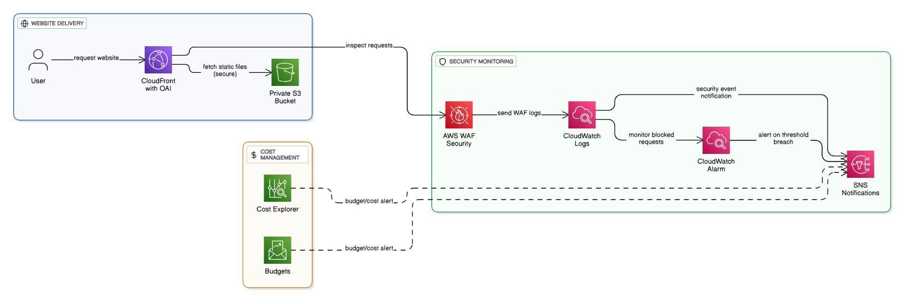
</div>
  

## 📋 Detailed Step-by-Step Setup

### 🛠 Step 1:  Create a Private S3 Bucket

1.	Navigate to AWS Console → S3 → **Create bucket**

2.	Enter a unique bucket name: ``awsfirst-project`` 

3.	Block Public Access: **Enable** all options ✅
<div align="center">
      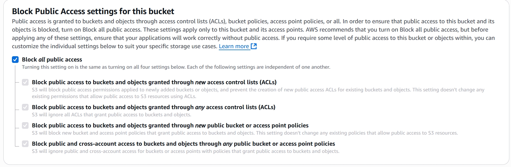
</div>

4.	**Create bucket**

5.  **Upload Website Files**: Open the bucket → Upload Add → ``index.html`` and other assets

<div align="center">
      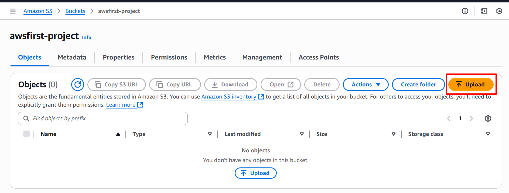
</div>
<div align="center">
      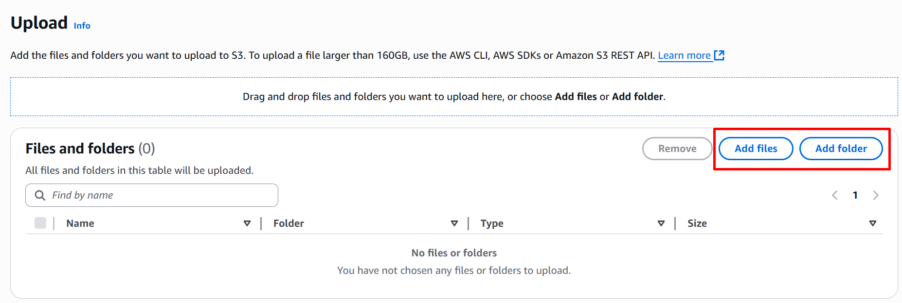
</div>

**Files remain private** (**no public access**)

<div align="center">
      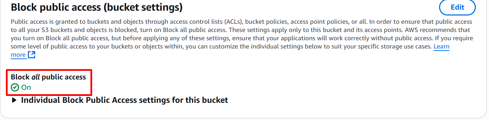
</div>
<div align="center">
      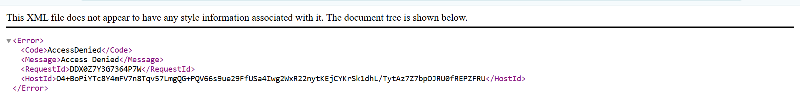
</div>

### 🛠 Step 2: Create CloudFront Distribution with OAI

1.	Go to CloudFront → **Create distribution**

<div align="center">
      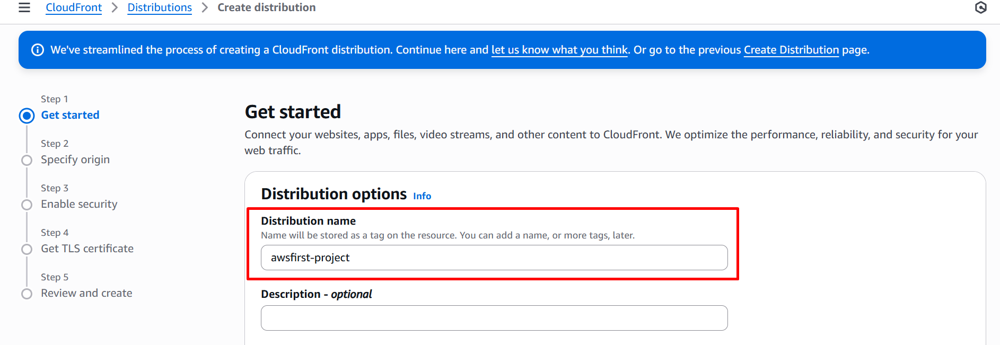
</div>

2.	Origin domain: **Choose your S3 bucket**

<div align="center">
      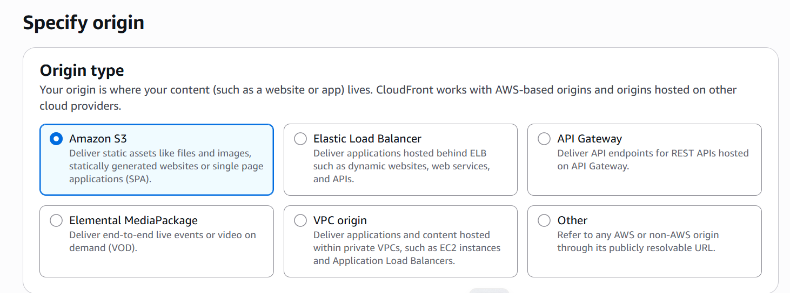   
</div>

<div align="center">
      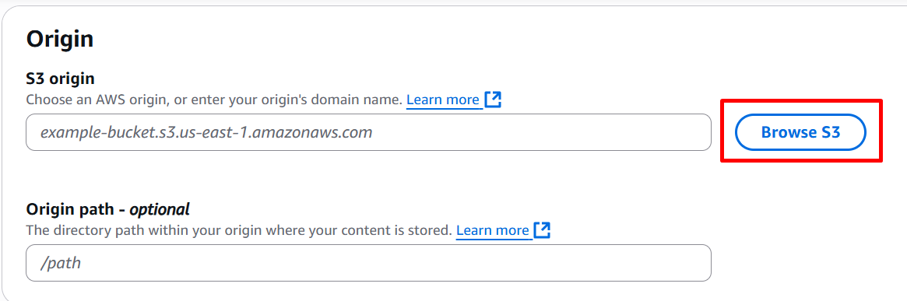
</div>

3.	Origin access:

     •	Select **Origin Access Identity (OAI)**

     •	Create new OAI →
                **Update bucket policy automatically** ✅

5.	Viewer protocol policy: Redirect HTTP to HTTPS
7.	Default root object: ``index.html``
8.	**Create distribution** and wait until **Deployed**

<div align="center">
      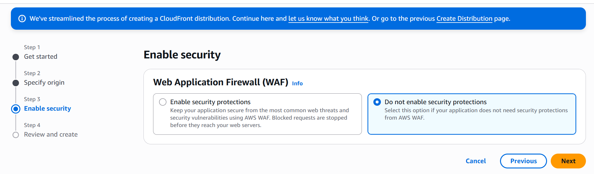
</div>


<div align="center">
      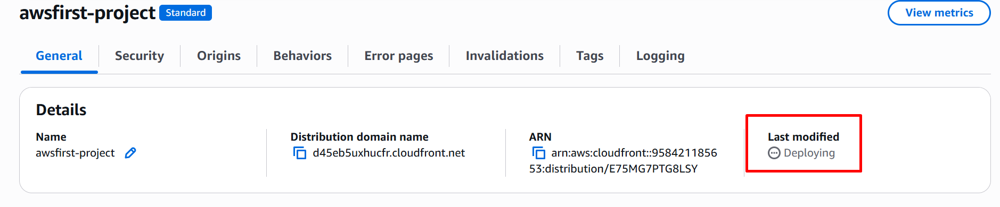
</div>

### Test: Visit your CloudFront domain 

<div align="center">
      
</div>

**Alert:** Don't be panic.

<div align="center">
      
</div>

**Solve:** Scroll down this file and Go to problem statement

### 🛡 Step 3 : Attach AWS WAF to CloudFront

1.	Go to WAF & Shield → Web ACLs → **Create web ACL**

2.	Region: **Global (CloudFront)**

3.	Resources to protect: Select your CloudFront distribution

4.	Add AWS Managed Rules:

    • **AWSManagedRulesCommonRuleSet (common attacks)**

    • **AWSManagedRulesKnownBadInputsRuleSet (SQL Injection, XSS)**

5.	Create Web ACL

✅ Your website is now protected from SQL Injection and XSS attacks.

### Step 4: Enable CloudWatch Logs for WAF

1.	Navigate to WAF → Your Web ACL → **Logging and metrics tab**

2.	Click Enable logging → **CloudWatch Logs**

3.	Create log group: ```aws-waf-logs-webacl-first```

4.	Enable Store full logs ✅

Sample Log JSON:

<div align="center">
      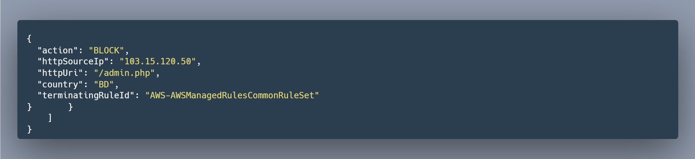
</div>

### Step 5: Set Up Amazon SNS for Notifications (Independent)

1.	Go to Amazon SNS → **Create topic**

    ```Type: Standard```
	```Sample Name: WAFNotifications```
2.	Create subscription →
             Protocol:  Email → **Add your email**

4.	Check your inbox and Confirm subscription

5.	You can now manually publish notifications or link with alarms later if needed

✅ SNS is now ready to send notifications separately.

### Step 6: Create a CloudWatch Alarm for WAF Activity
1.	Go to CloudWatch → Alarms → **Create alarm**

2.	Select metric: ```WAFV2 → WebACL → BlockedRequests```

3.	**Threshold example:** Trigger if >= 60 requests within 1 minutes

4.	Alarm action:

      • Send notification to your existing SNS topic (WAFNotifications)

5.	Alarm name:  ```WAF-BlockedRequests-High``` → **Create alarm**

✅ You will receive email alerts whenever the blocked requests exceed the threshold.

### Step 7: Enable Cost Explorer and AWS Budgets
1.	Billing → Cost Explorer → **Enable Cost Explorer**

2.	Budgets → **Create budget** → **Cost budget**

     ```Example: $5 per month``` Add your email for budget alerts

3.	Monitor usage and spending in Cost Explorer dashboard

✅ You will receive alerts if AWS spending exceeds your defined budget.

### Project Output

•	Secure Static Website URL via **CloudFront** (**HTTPS**).

•	**WAF Protection** with blocked requests (**403 Forbidden**).

•	**CloudWatch Logs** with request details.

•	**SNS Notifications** for alerts.

•	**CloudWatch Alarm** for blocked traffic spikes.

•	Cost Management with **AWS Budgets and Cost Explorer**.

### Problem Statement ⚠️

**During the implementation of this AWS Secure Static Website Hosting project, two main challenges were encountered:**

1️⃣**CloudFront did not serve the ```index.html``` file**

**Issue:** After creating the CloudFront distribution, the website URL showed Access Denied or a blank page instead of loading ```index.html```.

**Cause:** CloudFront requires a Default Root Object to be set ```index.html``` when serving content from a private S3 bucket via OAI.

**Solution:**

1.	Updated the CloudFront Distribution → **Default Root Object to ``index.html``**
2.	After deployment, the website loaded successfully.

2️⃣**CloudWatch Logs did not capture WAF logs**

**Issue:** After enabling WAF logging, no logs appeared in **CloudWatch** initially.

**Cause:** WAF logging requires a **specific log group naming format in CloudWatch** for the connection to work properly.

**Solution:**

• Created a CloudWatch log group with the format: ```aws-waf-logs-<name>```

**Example:** ```aws-waf-logs-securewebsite```

1. **Re-attached** the log group to the **WAF Web ACL** and enabled full logging.
2. Logs started appearing in **CloudWatch Logs** as expected.

**Key Takeaways :**

1. Always configure the **Default Root Object in CloudFront** to serve static websites correctly.

2. Use the **correct log group naming format ```aws-waf-logs-<name>``` for WAF** to successfully push logs to CloudWatch.


**Note:** *This Problem Statement will help others avoid the same configuration mistakes when deploying a secure AWS static website.*
